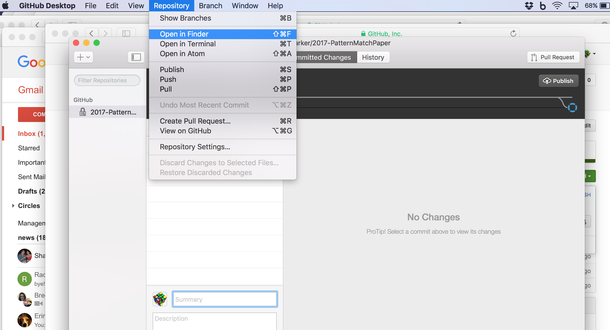

# GitHub-Branching-Workflow

**Shaun Harker 2016-12-29-1245**

Below I discuss a GitHub workflow suitable for currently available GUIs. I'm accustomed to the command line approach myself, but that's a barrier to entry. (The good news is people who like command line can go ahead and do command line and no one else will be the wiser.) This workflow is a simplified workflow from the one I usually advocate, to ensure it can be made to work with the less flexible GUIs. 

For this workflow, the basic idea is there is only one repository and no forks. This single repo has a `master` branch, and it also has development branches for each collaborator. Importantly, no one pushes/commits directly to the `master` branch. Instead, coauthors commit to their dev branch, and then submit Pull Requests (PRs) to have their changes pulled from their dev branches into `master` after (presumably cursory) review (mainly, ensuring the commit was intentional). This shouldn't cause a delay since authors can approve their own PR. Coauthors can also pull from `master`, (via a button marked "Update from master" on the GUI) which is necessary to bring themselves up-to-date with other coauthor's work. Notably, all communication of writing between authors goes through `master` and is subjected to the PR mechanism.

The point of the PR mechanism is (1) to isolate mistakes into the branch of the person who made the mistake, who can deal with it without accidentally messing anyone else up, and also (2) to encourage review of changes using the GitHub interface.

## Getting Set Up

**Step 1.** Make a GitHub account <https://github.com>

**Step 2.** Download and install the <https://desktop.github.com> app. (Note: It has a tutorial. It had weird pop-ups that seemed kind of buggy, so I removed the tutorial by doing a two-finger click on it and clicking "remove". You might want to try it out instead of just unceremoniously trashing it however.)

**Step 3.** Let the main repo owner to invite you as a collaborator. In other words, let me know your GitHub username so I can invite you to my private repository. You become a _collaborator_ on this repo.

**Step 4.** Go to the GitHub website and find the repo I invite you to: `shaunharker/2017-PatternMatchPaper`

**Step 5.** Click on the "Clone or Download" button and then "Open in Desktop". This should open up the GitHub Desktop app.

It does seem to act a little goofy, but just click on "Allow":

**Step 6.** GitHub Desktop will open up. Follow its instructions to save a clone on your computer.

**Step 7.** **DO NOT FORGET THIS STEP.** Click on the **Add a branch** button. Give it your new branch name without spaces, e.g. "shauns-edits" (well, if your name happens to be Shaun).

Forgetting this step means you are still on `master` and your commits would be directly editing the repository's master branch and circumventing important safety mechanisms. Don't do this. Make a branch. (If it was your own private fork, it wouldn't be such a big deal, but that doesn't end up working out with the GUI approach.) I'll see if I can explicitly prevent it somehow. 

## Making Edits

(The following steps are repeated for each round of edits.)

**Step 1.** **Update from master** to pull in other commits. This should work without conflicts. (If the button is greyed out, you are already up-to-date.)

**Step 2.** Go to the menu and click "Repository" then "Open in finder." (Or otherwise just remember where you saved it and go to it directly.)

**Step 3.** Make edits according to your usual workflow.

**Step 4.** Inspect your changes on GitHub Desktop.

**Step 5.** **Commit** to your branch (click button on lower left of GitHub Desktop)

**Step 6.** **Update from master** to pull in other commits which may have occurred which you made changes. Since your changes might be on some of the same lines as other changes, GitHub may complain about conflicts. 

In this case, what you do is edit the files it marks as conflicted. Again, use whatever your usual workflow is. 

The conflicted files will be marked up so you can see where the confusion arose:

Just change it however you'd like that fixes it (you don't have to pick one or the other; just do whatever works and save the fixed file.)

Then commit again. This puts your branch in a state that it is "ahead" of the `master` branch, so you are ready to do the next step.

**Step 7.** Click on **Pull Request** (on the upper right). This opens up a dialogue and you supply a brief message. Then click **Send Pull Request**. You should then get:

The result of this is that we can now merge the PR into the `master` branch (which is what everyone sync from in order to get changes.) Github (the website) offers tools to review PRs and see that they are good.

The key feature is being able to see the differences in the files.

The PR will be merged and other people can sync it. 

