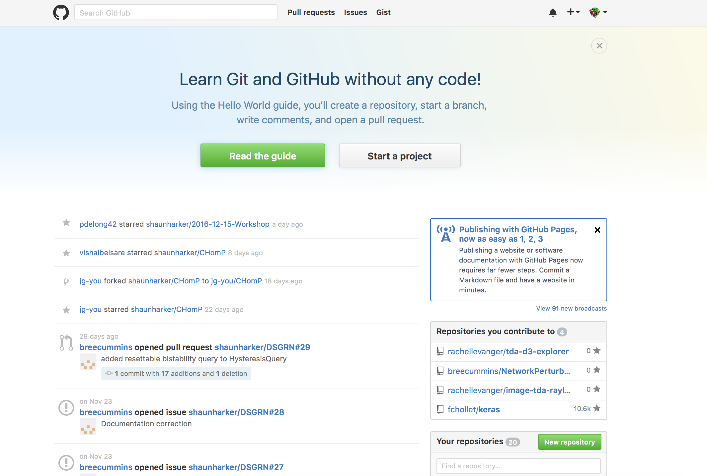
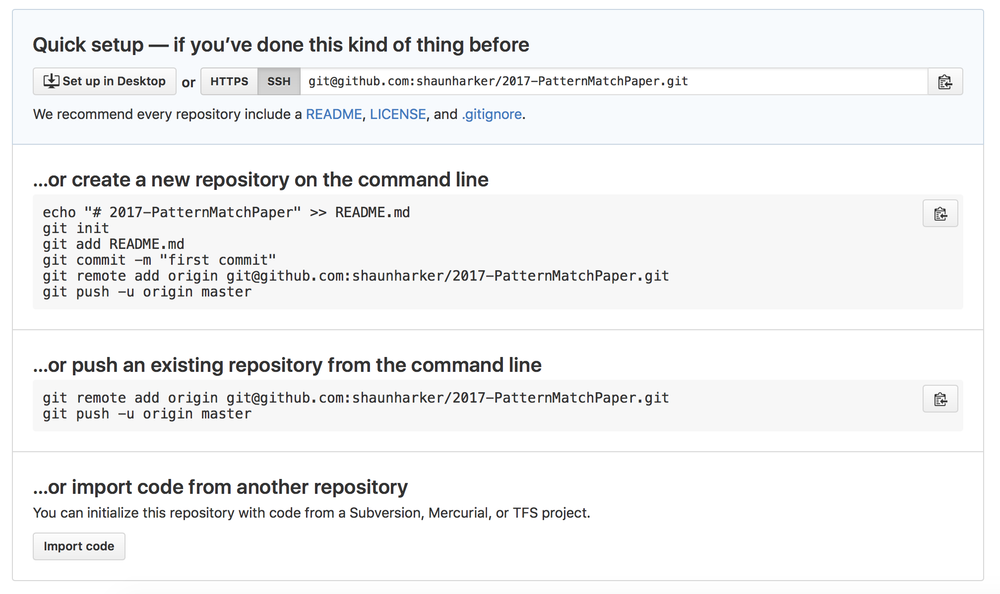
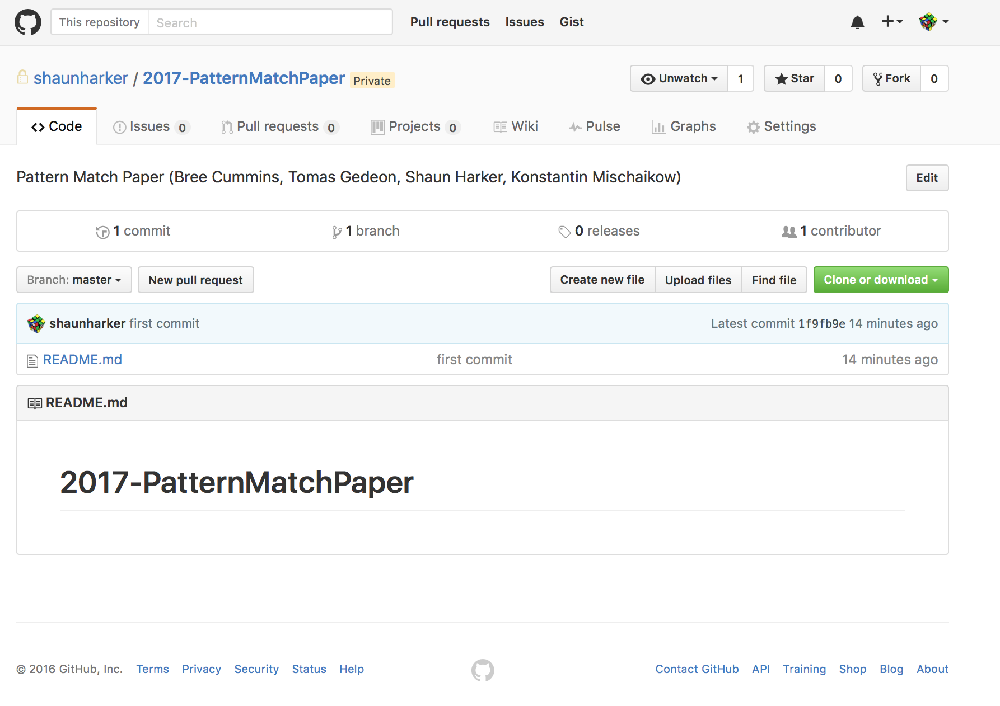
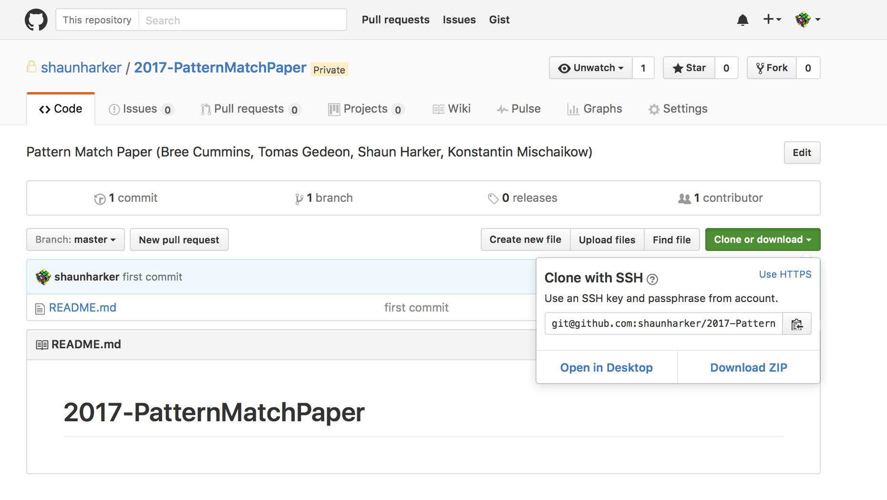
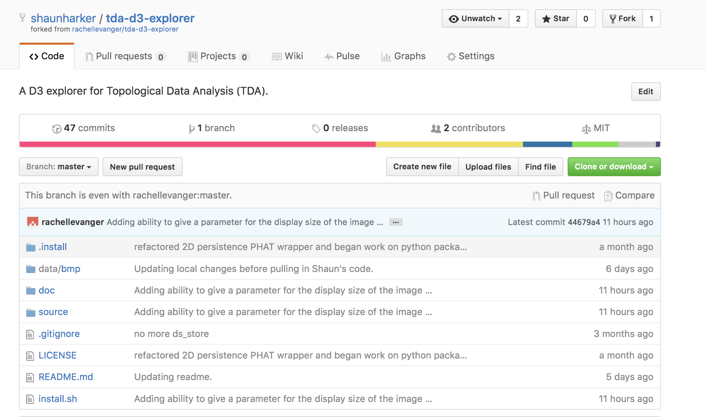
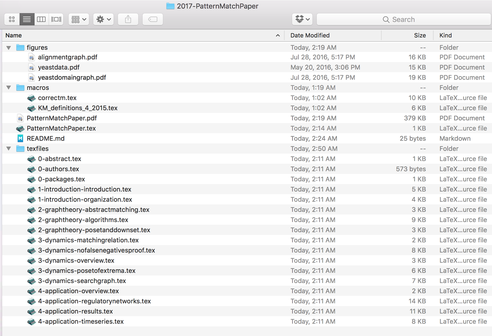
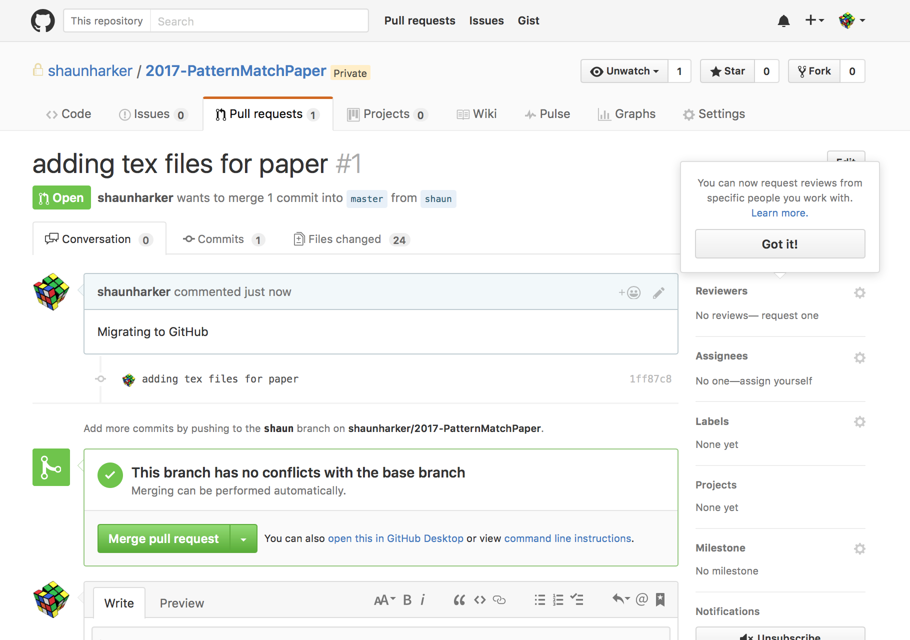
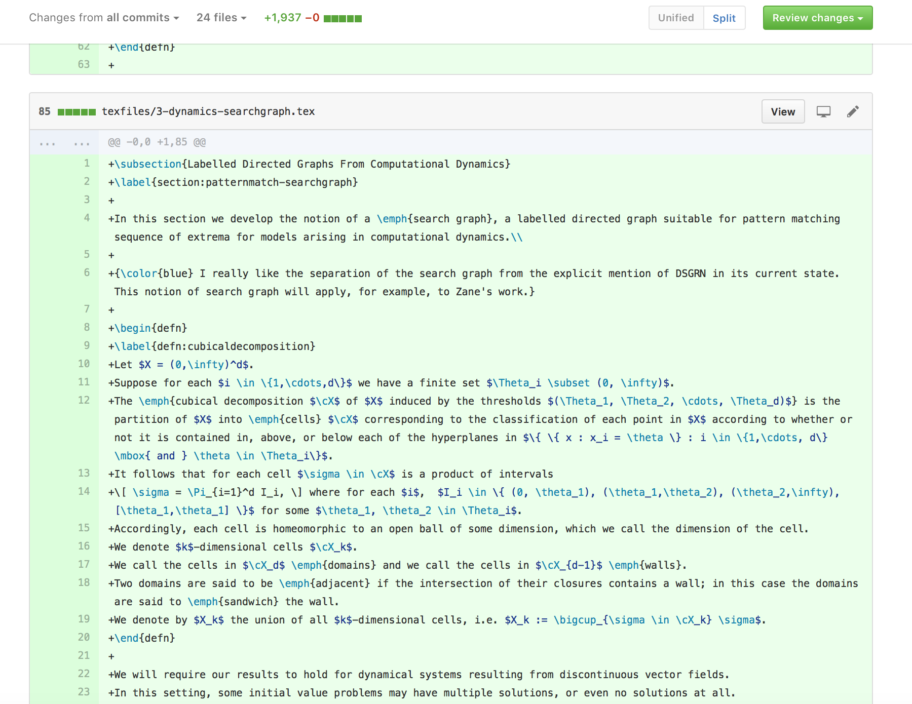
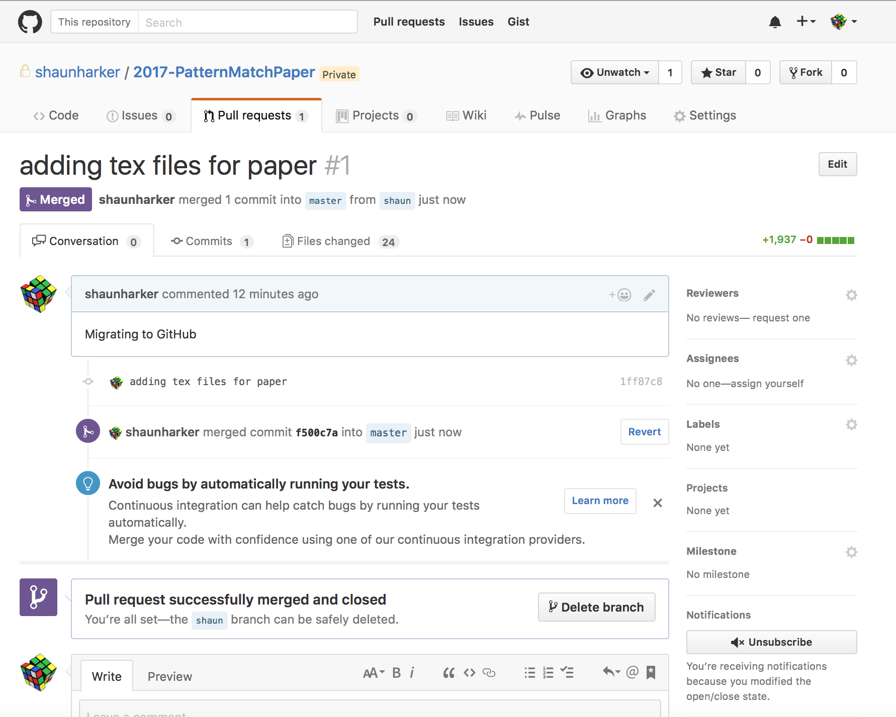

# GitHub-Forking-Workflow

**Shaun Harker 2016-12-29-1245**

I start with a "cheat sheet"; a more in-depth tutorial follows after.

# GitHub Cheat Sheet

### (0) Getting set-up

* Make a GitHub account
* Follow the steps on <https://help.github.com/articles/generating-an-ssh-key/> to make sure you have passwordless access
* Fork the main repository using the "Fork" button on Github
* Find your forked repo on GitHub and get the URL from the button that says "Clone or Download"
* Open up a terminal, and type:
* `git clone git@github.com:YOUR_USER_NAME/2017-PatternMatchPaper.git`

### (1) Making changes to your local files and committing those changes to your forked repo

* Edit the files in your local repo.
* `git status` to check on which changes have been made
* `git add` files in order to stage them for commits
* `git commit -m "useful commit message"` to commit changes
* `git push` in order to push the changes into your forked repository

### (2) Merging other people's work with your own.


* `git pull mainrepo master` (Pull in changes from coauthors)
* `git status` (to see what conflicts there are),
* Edit the conflicted files so they are correct. 
* `git add conflicted-file.tex` (to mark resolution of the conflicted files once they are editied), and 
* `git commit -m "merged changed from main repository"` (to commit the merge after all conflicts are resolved).
* `git push` (to sync your changes to your forked repo)

### (3) Making your edits available to others

* `git status` and make sure you've commited your own edits as in (1).
* `git pull mainrepo master` and resolve conflicts as in (2).
* `git push` to make sure your forked repo is up-to-date with your local repo.
* Go to <https://github.com> and find your forked repo, and click "Pull Request" and fill out the comments indicating what kind of changes were made.

## Initial Setup

* I went to <https://github.com>. 



* I clicked on "New Repository". 


* I chose to make a private repository. (I pay the \$7 per month.)
* I named it and gave it a description.
* I clicked "Create repository"

The following was displayed:


* I prefer SSH to HTTPS since it uses ssh-keys to avoid password entry when I need to commit. So I clicked the SSH tab. (See Remark 1 in notes below for how this can be changed later if desired.) This changed the text to:



* I followed the instructions for "...or create a new repository on the command line.". To wit:
* I opened up a terminal prompt and typed the following (i.e. directly followed the instructions):

```bash
cd Desktop
mkdir 2017-PatternMatchPaper
cd 2017-PatternMatchPaper
echo "# 2017-PatternMatchPaper" >> README.md
git init
git add README.md
git commit -m "first commit"
git remote add origin git@github.com:shaunharker/2017-PatternMatchPaper.git
git push -u origin master
```

* I checked the browser and clicked on my repo to see things had indeed worked:



### Basics

It is not, perhaps, immediately clear what has been done, so let's stop and explain a couple concepts.

* Git vs GitHub
* Repositories
* Local Repositories: `git status`
* Remote Repositories: `git remote`
* Cloning: `git clone`
* Syncing: `git pull` `git push`
* Staging: `git add` `git rm` `git mv` 
* Committing: `git commit`

#### Git vs GitHub

* Git and GitHub are not the same thing
* `git` is a command line program which does version control
* `GitHub` is a company that does a great job of managing remote `git` repositories to make it easy to share work.

#### Repositories

* A _repository_ is a folder with files that are under version control.
* What has happened thus far is I have created a repository.
* In fact, I have created _two_ repositories: the one on my laptop, and the one on GitHub.

#### Local Repository

* What is special about the folder on my laptop which makes it a Git repository? Typing `ls -a` on the command line reveals the secret. There is a hidden directory named `.git` in the root of the repository. This is how `git` knows what is going on when it is issued directives. It's completely self-contained.
* If we type `git status` this is revealed:

```
1 ✓ /Users/sharker
sharker@athena [03:45:25] > git status
fatal: Not a git repository (or any of the parent directories): .git
```

But if I navigate into the `2017-PatternMatchPaper` repository, it's a different story:

```
4 ✓ /Users/sharker/Desktop/2017-PatternMatchPaper
sharker@athena [03:45:54] > git status
On branch master
Your branch is up-to-date with 'origin/master'.
Untracked files:
  (use "git add <file>..." to include in what will be committed)

	.gitignore
	PatternMatchPaper.tex
	macros/
	texfiles/

nothing added to commit but untracked files present (use "git add" to track)
```

* It says `On branch master` which reflects a concept that a repository can have several distinct development states at the same time, called branches. We only have a single branch called `master`. I think that is probably the easiest thing to start with. (I'll use a branch later to "pretend" I'm another contributor so I can demonstrate the contribution workflow.)

* Clearly `git` didn't write our paper so as you can surmise I've moved some files in. I did this by simply drag-and-drop, nothing special at all. Thus, I haven't told the version control of git about, them, so `git status` sees them and let's me know they are _untracked_. 
* The `.gitignore` is a file I made as well; also not tracked yet until I tell it to. It has special meaning to `git`; it tells it that sometimes I will put some files in the repository that I don't want it to whine about not being under version control when I type `git status` (e.g. all the junk files a tex compilation will create).


#### Remote Repository

* The repository on my laptop is aware of the repository on GitHub. which it regards as a _remote repository_. It has a special name, called `origin`. I can see this as follows:

```bash
42 ✓ /Users/sharker/Desktop/2017-PatternMatchPaper
sharker@athena [03:04:31] > git remote -v
origin	git@github.com:shaunharker/2017-PatternMatchPaper.git (fetch)
origin	git@github.com:shaunharker/2017-PatternMatchPaper.git (push)
```

* Note the remote repository is not my entire GitHub account. It is that specific project.
* Recall that `git status` mentioned the repository was up to date with `origin/master`. Since `origin` is the remote repository on GitHub, what it is saying is that there is no information on the GitHub repository that isn't on my local repository. The `master` part of `origin/master` is called a branch; there is only one branch currently and it is named `master` (the traditional name for the main branch) so we can ignore this aspect.


#### Cloning Repositories

* If I wanted, I could throw the git repository I have in the trash. No special uninstallation is required.
* But what if I wanted it back? I could just clone it from the GitHub copy:

```
git clone git@github.com:shaunharker/2017-PatternMatchPaper.git
```

Where does that crazy URL come from, anyway? Here's how you can get a hold of it:



What this technically does is creates a new github repository which is identical to the one at GitHub and sets up the remote named `origin` to be the GitHub repository. (It also sets up "tracking" so `git status` will tell me if I'm ahead or behind or up-to-date.) This is precisely the situation we already have, so this is just saying "yes, since we are up-to-date, we can trash our local copy and not lose data."

* Note we could have two different machines which both have performed `git clone` on the GitHub repository, and they can both interact with it. The idea is to keep it simple though; don't make a bunch of repos and then talk in weird patterns. Use the central GitHub repo as, well, a hub. A star-shaped topology.

#### Syncing Repositories

* **Pushing.** If I change my local repository, it doesn't change the remote repository automatically. That has to be explicitly ordered via a `git push` directive which asks it to propagate changes to the remote repository.
* **Pulling.** Conversely, if the remote repository gets changed (let's say I did a `git push` from another clone on another machine) these changes do not automatically propagate downstream to my computer. I would have to explicitly order this with `git pull`.

#### Staging and Committing changes

* In fact, if I edit files in my local repository, it doesn't technically change even my local repository. There is a two step process to achieve this. First, we _stage_ the changes. Then, we _commit_ them. The relevant commands here are:

```bash
git add <new-or-modified-file>
git rm <file-i-no-longer-want-under-version-control>
git mv <file-to-give-a-different-name-or-location>
git status # tell me which files I 
git commit -m "commit message explaining set of changes"
```
* Until `git commit`, all `git add` and `git rm` are simply _staged changes_. The transaction is not complete and can be rolled back easily. 
* `git add` lets me tell it I'm putting a new file under version control.
* `git rm` lets it know I'm getting rid of something.
* If I insert a file but don't tell it to `git add`, then `git status` will let me know there is a file untracked by version control, reminding me to `git add` it.
* If I `rm` a file (not `git rm`) then `git status` will let me know its gone, but tell me its an unstaged change.
* Once I check `git status` and see things are staged as I want them, I issue `git commit -m "explanation of changes"`, and this _commits the new version to the repository_.
* I can then issue a `git push` to push those changes to the remote GitHub repository.

Example:

```bash
# Assume I made a new file "file.txt" 
#   and want to commit the change
git add file.txt
git commit -m "added a file named file.txt"
git push
```

## Forking Workflow

* At this point, you are probably thinking "All right then, what are you waiting for, `git add` those tex files, then `git commit` the staged changes, and then `git push` to the remote repository!"
* Sure, that would work for _me_. But I'm the only person who can commit to this repo in this way. 
* **I won't actually add the coauthors as people who can make direct changes to this repo.** 
* Instead, everybody makes their own "fork", and people modify their fork, and then do **Pull Requests** (PRs) on the main repository after they make sure their changes are up-to-date and on top of what already has been pushed to the main repo (and thus can be merged without conflict).

### Forked Repositories

* On GitHub, it is possible to make something called a _fork_ of a repository. This is nothing more than just a copy of a repository that is aware it has been copied. But unlike a local repository that has been cloned, it is again a remote repository on GitHub.
* How collaboration will work is **each coauthor makes a fork of the main repo**, which gives them a GitHub repository. Important point: forking a private repository again gets you a private repository. This is the only way a person who doesn't pay GitHub a small monthly fee can get a private repo. (<http://stackoverflow.com/questions/9629538/if-i-fork-someone-elses-private-github-repo-into-my-account-is-it-going-to-app>)
* Here is how a forked repo appears:


* Then, after the fork is made, a local repository is made from the fork via `git clone`. The `origin` remote to the local repo is the forked repository on GitHub.
* Then work can proceed as normal, just using the forked repository instead of the original one, with no toes stepped on.
* But eventually, changes need to get put back into the main repository. And also, changes to the main repository need to be kept up with somehow.
* In other words, there needs to be a way to `git pull` from the main repo, and `git push` to the main repo. It turns out `git pull` works just fine (but you have to give it an argument to say to pull from the main repo and not the forked repo), put `git push` is a no go -- you don't have rights to push to the main repo! You only have rights to `git push` to your own fork. Instead of pushing, you request that the main repo maintainer do a `git pull` from your fork. So syncing your forked repo with the main repo is a matter of `git pull`ing, which requires no authorization, and **Pull Requests**, which cause an e-mail to be sent and GitHub has a great little feature to see what the changes can be merged and make it as simple as clicking a button if all is done properly (i.e. the PR can be merged without conflicts).

* More details:

#### Keeping your fork up to date with the main repository

* To bring in changes from the main repo really is just `git pull`. Except you have to tell it to pull from a remote other than `origin`. There are two ways to do this:

```
git pull https://github.com/shaunharker/2017-PatternMatchPaper.git master
```

This is the method of <https://help.github.com/articles/merging-an-upstream-repository-into-your-fork/>. This command tells `git` to "pull in all the commits I don't have from the main repository on the branch `master`." 

Rather than having to type `https://github.com/shaunharker/2017-PatternMatchPaper.git` every time this common operation is done it is better to set this up as a remote. This would only need to be done once:

```
git remote add mainrepo https://github.com/shaunharker/2017-PatternMatchPaper.git
```

Typing `git remote -v` would then tell you about _two_ remote repositories it knows about: `origin` (your forked repository), and `mainrepo` (the main repository).

After setting up the remote you could pull in changes more easily with

```
git pull mainrepo master
```

To be explicit, here is an example.

I currently have a forked repository from Rachel Levanger's project, and I'm behind a few commits:


Note I'm 6 commits behind. Let me check out my local repository which is `git clone` from my fork.

```bash
31 ✓ /Users/sharker/Unison/Work/tda-d3-explorer
sharker@athena [04:33:50] > git status
On branch master
Your branch is up-to-date with 'origin/master'.
Changes not staged for commit:
  (use "git add <file>..." to update what will be committed)
  (use "git checkout -- <file>..." to discard changes in working directory)

	modified:   .gitignore

no changes added to commit (use "git add" and/or "git commit -a")
```

What this says is I am up to date. It also says I've made a local modification to a file called `.gitignore` but haven't staged that for a commit (I could easily revert the change). This is not something I need to worry about.

But wait, aren't I six commits behind? Well, what this says is my _local repository_ is up to date with the remote named `origin`, which is my _forked repository_. But the _forked repository_ is six commits behind Rachel's main repository. Let's check and see if I have the main repo on speed-dial as a remote:

```
32 ✓ /Users/sharker/Unison/Work/tda-d3-explorer
sharker@athena [04:33:53] > git remote -v
origin	git@github.com:shaunharker/tda-d3-explorer.git (fetch)
origin	git@github.com:shaunharker/tda-d3-explorer.git (push)
rachel	git@github.com:rachellevanger/tda-d3-explorer.git (fetch)
rachel	git@github.com:rachellevanger/tda-d3-explorer.git (push)
```

Yes, I do, and I've named it `rachel` (rather than `mainrepo`). 

So let's do

```
git pull rachel master
```

This then says:

```
33 ✓ /Users/sharker/Unison/Work/tda-d3-explorer
sharker@athena [04:34:03] > git pull rachel master
remote: Counting objects: 34, done.
remote: Compressing objects: 100% (20/20), done.
remote: Total 34 (delta 22), reused 25 (delta 13), pack-reused 0
Unpacking objects: 100% (34/34), done.
From github.com:rachellevanger/tda-d3-explorer
 * branch            master     -> FETCH_HEAD
   b567444..44679a4  master     -> rachel/master
Updating 5719d86..44679a4
Fast-forward
 README.md                                          |   32 +-
 doc/Tutorial.ipynb                                 | 2432 +-------------------
 explorer.html                                      |  677 ------
 install.sh                                         |    2 +
 .../PersistenceExplorer/PersistenceExplorer.py     |    7 +-
 .../WebApp/PersistenceExplorer.css                 |    3 +-
 .../WebApp/PersistenceExplorer.js                  |  116 +-
 7 files changed, 122 insertions(+), 3147 deletions(-)
 delete mode 100755 explorer.html

```

This is crazy computer talk for "OK, I pulled in the new information from Rachel's master branch and now you are up to date with that."

But, if I were to go onto GitHub, I'd still see I'm six commits behind. Why is that? Because that's a different repository; I just updated my _local repository on my laptop_ with Rachel's commits to her master repo. My forked repository doesn't know about this yet.

Let me check `git status` again:

```
34 ✓ /Users/sharker/Unison/Work/tda-d3-explorer
sharker@athena [04:38:24] > git status
On branch master
Your branch is ahead of 'origin/master' by 6 commits.
  (use "git push" to publish your local commits)
Changes not staged for commit:
  (use "git add <file>..." to update what will be committed)
  (use "git checkout -- <file>..." to discard changes in working directory)

	modified:   .gitignore

no changes added to commit (use "git add" and/or "git commit -a")

```

This tells me about the issue. As far as it is concerned, those 6 commits are just like any other 6 commits I may have made locally and not pushed to my `origin` repo yet. So... I'll push them.

```
35 ✓ /Users/sharker/Unison/Work/tda-d3-explorer
sharker@athena [04:40:23] > git push
Counting objects: 34, done.
Delta compression using up to 8 threads.
Compressing objects: 100% (33/33), done.
Writing objects: 100% (34/34), 5.09 KiB | 0 bytes/s, done.
Total 34 (delta 22), reused 0 (delta 0)
remote: Resolving deltas: 100% (22/22), completed with 10 local objects.
To github.com:shaunharker/tda-d3-explorer.git
   5719d86..44679a4  master -> master

```

Now I can check `git status` again:

```
36 ✓ /Users/sharker/Unison/Work/tda-d3-explorer
sharker@athena [04:41:30] > git status
On branch master
Your branch is up-to-date with 'origin/master'.
Changes not staged for commit:
  (use "git add <file>..." to update what will be committed)
  (use "git checkout -- <file>..." to discard changes in working directory)

	modified:   .gitignore

no changes added to commit (use "git add" and/or "git commit -a")

```

...and I'm up to date. If I go on the GitHub website it will tell me my forked repository is up to date with Rachel's main repo.



## Resolving Conflicts

* There is an awful thing that can happen when you `git pull`. That _will_ happen. It's called a _conflict_.
* This is when you attempt to do a `git pull` and `git` yells at you and says it can't do it, since you are out of whack with what you are trying to pull in.
* For instance, suppose you fork my repo, and then ignore the main repo for 3 months, during which I make some commits.
* Suppose you also make some commits during this time.
* Then your fork can be in a state where it is _both behind and ahead of mine_.
* Attempting to `git pull` from my repo might cause a conflict, since you might have changed something I also changed, and it doesn't know whether to do what I did or keep what you did.
* What `git` will do is simply tell you there was some kind of problem, and leave it to you to clean up the mess.
* How this is resolved is you just settle the conflicts by editing the files that are marked by `git status` as being conflicted in order to remove the conflicts (i.e. make the file correct). Then you `git add` the resolved version, and once all conflicted files have been fixed and `git add`ed, you `git commit` in order to finish the merge. (Technically, a `git pull` is a type of merge. It can be thought of as composing two sub-commands `git fetch` and `git merge`)

## Workflow

I want to demonstrate the workflow, but since I am the main repo owner I have to more or less "simulate" what it would be like to not be me. So what I will do is make a branch called `shaun` and we will pretend this is the `master` branch of a forked repository.

So to be clear: in the example I'm doing, I will have a single repository with a branch `master` and a branch `shaun`. But this pretty much identical to the case of having main repo with a branch `master` and a forked repository with a branch `master`, respectively.

The branch manipulations can be skimmed over here if you plan to just work in `master`.

First I make my new branch:

```
git checkout -b shaun  # Switch to a new branch named "shaun"
git push origin shaun  # Let my fork know about this new branch.
```

Here is me doing just that:

```
41 ✓ /Users/sharker/Desktop
sharker@athena [05:05:11] > cd 2017-PatternMatchPaper/

42 ✓ /Users/sharker/Desktop/2017-PatternMatchPaper
sharker@athena [05:05:14] > git checkout -b shaun
Switched to a new branch 'shaun'

43 ✓ /Users/sharker/Desktop/2017-PatternMatchPaper
sharker@athena [05:05:44] > git push origin shaun
Total 0 (delta 0), reused 0 (delta 0)
To github.com:shaunharker/2017-PatternMatchPaper.git
 * [new branch]      shaun -> shaun
```

So now I'm thinking in terms of the owner of the forked repository, who is going to do some work and then submit a PR to the main repo maintainer. 

Because I did a `git push`, I can see this new branch showing up on GitHub:
 


So far so good. So now what I'm going to do is just work in my `shaun` branch (which is analogous to a coauthor working in their forked repo). Let's check out what `git status` says about things:

```
44 ✓ /Users/sharker/Desktop/2017-PatternMatchPaper
sharker@athena [05:05:53] > git status
On branch shaun
Untracked files:
  (use "git add <file>..." to include in what will be committed)

	.gitignore
	PatternMatchPaper.tex
	macros/
	texfiles/

nothing added to commit but untracked files present (use "git add" to track)
```

It says I'm on branch `shaun`. I have some files I want to put under version control. It's time for me to finally stage and commit these changes.

There are quite a few files to stage and commit and it would be annoying (but not impossible) to `git add` them all individually:



It turns out there is a shortcut here: I can type

```
git add .
```

This will tell it to stage every file it finds, recursively into subdirectories, with the exception of files listed in `.gitignore`.

The reason for a `.gitignore` is not only to avoid unimportant files from getting into the repo, like `.DS_Store` OS files, but also the general rule is we don't want to include files _which are generated by the other files in the repository_. For software projects this means _you don't put generated binaries under version control._ For doing latex-papers, this means we don't put the generated pdf under version control. 

On the other hand, we note there are a few figures which are PDFs. This is not a problem. The reason is that _they do not change every single revision._ But since I put `.pdf` in the `.gitignore` file this means I have to deal with them as exceptions:

```
46 ✓ /Users/sharker/Desktop/2017-PatternMatchPaper
sharker@athena [05:26:20] > git add .

47 ✓ /Users/sharker/Desktop/2017-PatternMatchPaper
sharker@athena [05:26:23] > git status
On branch shaun
Changes to be committed:
  (use "git reset HEAD <file>..." to unstage)

	new file:   .gitignore
	new file:   PatternMatchPaper.tex
	new file:   macros/KM_definitions_4_2015.tex
	new file:   macros/correctm.tex
	new file:   texfiles/0-abstract.tex
	new file:   texfiles/0-authors.tex
	new file:   texfiles/0-packages.tex
	new file:   texfiles/1-introduction-introduction.tex
	new file:   texfiles/1-introduction-organization.tex
	new file:   texfiles/2-graphtheory-abstractmatching.tex
	new file:   texfiles/2-graphtheory-algorithms.tex
	new file:   texfiles/2-graphtheory-posetanddownset.tex
	new file:   texfiles/3-dynamics-matchingrelation.tex
	new file:   texfiles/3-dynamics-nofalsenegativesproof.tex
	new file:   texfiles/3-dynamics-overview.tex
	new file:   texfiles/3-dynamics-posetofextrema.tex
	new file:   texfiles/3-dynamics-searchgraph.tex
	new file:   texfiles/4-application-overview.tex
	new file:   texfiles/4-application-regulatorynetworks.tex
	new file:   texfiles/4-application-results.tex
	new file:   texfiles/4-application-timeseries.tex


```

As noted, it ignored my `.pdf` figures. But that's OK, since I can just `git add` them manually:

```
48 ✓ /Users/sharker/Desktop/2017-PatternMatchPaper
sharker@athena [05:26:26] > git add ./figures/alignmentgraph.pdf 
The following paths are ignored by one of your .gitignore files:
figures/alignmentgraph.pdf
Use -f if you really want to add them.
```

Uh, yes, I _really do_:

```
49 ✗ /Users/sharker/Desktop/2017-PatternMatchPaper
sharker@athena [05:27:51] > git add -f ./figures/alignmentgraph.pdf 

50 ✓ /Users/sharker/Desktop/2017-PatternMatchPaper
sharker@athena [05:28:55] > git add -f ./figures/yeastdomaingraph.pdf 

51 ✓ /Users/sharker/Desktop/2017-PatternMatchPaper
sharker@athena [05:29:06] > git add -f ./figures/yeastdata.pdf 
```

At this point, I have staged my files. They are ready to be committed. We do a `git status` and make sure there is nothing silly in there we don't want to commit to the repository, and then we issue the commit:

```
52 ✓ /Users/sharker/Desktop/2017-PatternMatchPaper
sharker@athena [05:29:11] > git commit -m "adding tex files for paper"
[shaun 1ff87c8] adding tex files for paper
 24 files changed, 1937 insertions(+)
 create mode 100644 .gitignore
 create mode 100644 PatternMatchPaper.tex
 create mode 100644 figures/alignmentgraph.pdf
 create mode 100644 figures/yeastdata.pdf
 create mode 100644 figures/yeastdomaingraph.pdf
 create mode 100644 macros/KM_definitions_4_2015.tex
 create mode 100644 macros/correctm.tex
 create mode 100644 texfiles/0-abstract.tex
 create mode 100644 texfiles/0-authors.tex
 create mode 100644 texfiles/0-packages.tex
 create mode 100644 texfiles/1-introduction-introduction.tex
 create mode 100644 texfiles/1-introduction-organization.tex
 create mode 100644 texfiles/2-graphtheory-abstractmatching.tex
 create mode 100644 texfiles/2-graphtheory-algorithms.tex
 create mode 100644 texfiles/2-graphtheory-posetanddownset.tex
 create mode 100644 texfiles/3-dynamics-matchingrelation.tex
 create mode 100644 texfiles/3-dynamics-nofalsenegativesproof.tex
 create mode 100644 texfiles/3-dynamics-overview.tex
 create mode 100644 texfiles/3-dynamics-posetofextrema.tex
 create mode 100644 texfiles/3-dynamics-searchgraph.tex
 create mode 100644 texfiles/4-application-overview.tex
 create mode 100644 texfiles/4-application-regulatorynetworks.tex
 create mode 100644 texfiles/4-application-results.tex
 create mode 100644 texfiles/4-application-timeseries.tex

```

Now we can ask `git status` how we are doing:

```
53 ✓ /Users/sharker/Desktop/2017-PatternMatchPaper
sharker@athena [05:31:11] > git status
On branch shaun
nothing to commit, working tree clean
```

(Note: for a coauthor working in their `master` branch this `git status` would have told them they were ahead on commits compared to the repo. The reason that didn't happen here is because the branch isn't set up to track properly -- see Remark 2 in the notes.) 

And now we can `git push`:

```
55 ✓ /Users/sharker/Desktop/2017-PatternMatchPaper
sharker@athena [05:31:55] > git push
Counting objects: 29, done.
Delta compression using up to 8 threads.
Compressing objects: 100% (29/29), done.
Writing objects: 100% (29/29), 79.39 KiB | 0 bytes/s, done.
Total 29 (delta 0), reused 0 (delta 0)
To github.com:shaunharker/2017-PatternMatchPaper.git
   1f9fb9e..1ff87c8  shaun -> shaun
```

Now heading over to GitHub, we can see it is aware something has happened:


Normally, however, nothing would be visible yet in the main repo, since the change would only be in the forked repo. But since I'm simulating the forked repo with my `shaun` branch, it says something here. However, see that it is showing a repository still with just the bare `README.md` and nothing else. This is because it is showing the `master` branch by default. But I just pushed to the `shaun` branch.

This is good, since I'm trying to demonstrate what's it should be like for a coauthor. The `master` branch is the main repo, the `shaun` branch is just like the `master` branch of the coauthor's forked repo.

So let's switch to the `shaun` branch and see the view that a coauthor would have looking at their `master` after their commit:


Notice how it tells me I'm one commit ahead of `master`. This is of course the commit we just did. For a coauthor's forked repo, there would be a similar message, saying it was ahead of the main repo.

To get my commit into `master` I'm going to do a _Pull Request_ (PR) as a coauthor would have to. This is goofy here since I am sending a Pull Request to myself, but it's perfectly allowed, and demonstrates what has to happen.


In general a comment is important explaining the intricacies of whatever the changes are, but in this case it's pretty obvious from the comment alone so I will just write "Migrating to GitHub". Then I click the "Create pull request."

This, of course, creates the pull request.

Let's change hats now, and look at things from the perspective of the main repo maintainer, who just got an e-mail notification that there is a pull request. This is what it will look like:



I can click on the "Files changed" tab, and it will show me the line-by-line changes for all 24 changed files. Since in this case all 24 files are actually completely new additions, it just shows the whole file in green:



If there were edits, it would show pink lines for deleted lines, and green lines for introduced lines, and it would avoid showing nearby lines. Here is an example from a commit on a software project:


Anyhow, let's accept the PR. This is done by clicking the "Merge Pull Request" button, and then "Confirm Merge". It informs me this is not a problem to do and there won't be merge conflicts. (In general, someone doing a PR is going to make the effort to make sure they are up-to-date with the master branch of the main repo so this is the case.)



It asks me if I want to delete the `shaun` branch too. That's a nice setup for when you have a branch named after some new feature, and do the work in there, and once its finally ready to get deployed you don't need that particular development branch anymore. But it's a bit of a red herring for us, since obviously if it was a coauthor contributing from their own forked repo I wouldn't be given an option to nuke their repo. But, sure I'll get rid of the `shaun` branch now that this demonstration is done.

Now let's check out my local repository.

Since we are thinking in terms of the main repo maintainer now, let me switch back to the master branch since this is the view they have:

```
63 ✓ /Users/sharker/Desktop/2017-PatternMatchPaper
sharker@athena [06:09:30] > git checkout master
Switched to branch 'master'
Your branch is behind 'origin/master' by 2 commits, and can be fast-forwarded.
  (use "git pull" to update your local branch)
```

This makes sense, since I haven't yet pulled the changes from my remote repo which just accepted the PR. So I do that:

```
72 ✓ /Users/sharker/Desktop/2017-PatternMatchPaper
sharker@athena [06:36:02] > git pull
Updating 1f9fb9e..f500c7a
Fast-forward
 .gitignore                                    |  27 ++
 PatternMatchPaper.tex                         |  41 +++
 figures/alignmentgraph.pdf                    | Bin 0 -> 16100 bytes
 figures/yeastdata.pdf                         | Bin 0 -> 14836 bytes
 figures/yeastdomaingraph.pdf                  | Bin 0 -> 19015 bytes
 macros/KM_definitions_4_2015.tex              | 247 ++++++++++++++++
 macros/correctm.tex                           | 395 ++++++++++++++++++++++++++
 texfiles/0-abstract.tex                       |  10 +
 texfiles/0-authors.tex                        |  16 ++
 texfiles/0-packages.tex                       |  43 +++
 texfiles/1-introduction-introduction.tex      |  39 +++
 texfiles/1-introduction-organization.tex      |  25 ++
 texfiles/2-graphtheory-abstractmatching.tex   |  43 +++
 texfiles/2-graphtheory-algorithms.tex         | 210 ++++++++++++++
 texfiles/2-graphtheory-posetanddownset.tex    |  46 +++
 texfiles/3-dynamics-matchingrelation.tex      |  24 ++
 texfiles/3-dynamics-nofalsenegativesproof.tex |  82 ++++++
 texfiles/3-dynamics-overview.tex              |  31 ++
 texfiles/3-dynamics-posetofextrema.tex        |  63 ++++
 texfiles/3-dynamics-searchgraph.tex           |  85 ++++++
 texfiles/4-application-overview.tex           |  21 ++
 texfiles/4-application-regulatorynetworks.tex | 179 ++++++++++++
 texfiles/4-application-results.tex            | 156 ++++++++++
 texfiles/4-application-timeseries.tex         | 154 ++++++++++
 24 files changed, 1937 insertions(+)
 create mode 100644 .gitignore
 create mode 100644 PatternMatchPaper.tex
 create mode 100644 figures/alignmentgraph.pdf
 create mode 100644 figures/yeastdata.pdf
 create mode 100644 figures/yeastdomaingraph.pdf
 create mode 100644 macros/KM_definitions_4_2015.tex
 create mode 100644 macros/correctm.tex
 create mode 100644 texfiles/0-abstract.tex
 create mode 100644 texfiles/0-authors.tex
 create mode 100644 texfiles/0-packages.tex
 create mode 100644 texfiles/1-introduction-introduction.tex
 create mode 100644 texfiles/1-introduction-organization.tex
 create mode 100644 texfiles/2-graphtheory-abstractmatching.tex
 create mode 100644 texfiles/2-graphtheory-algorithms.tex
 create mode 100644 texfiles/2-graphtheory-posetanddownset.tex
 create mode 100644 texfiles/3-dynamics-matchingrelation.tex
 create mode 100644 texfiles/3-dynamics-nofalsenegativesproof.tex
 create mode 100644 texfiles/3-dynamics-overview.tex
 create mode 100644 texfiles/3-dynamics-posetofextrema.tex
 create mode 100644 texfiles/3-dynamics-searchgraph.tex
 create mode 100644 texfiles/4-application-overview.tex
 create mode 100644 texfiles/4-application-regulatorynetworks.tex
 create mode 100644 texfiles/4-application-results.tex
 create mode 100644 texfiles/4-application-timeseries.tex

```

And now I have the latest code locally.

# Notes

## Remark 1.

* If the HTTPS choice had been made instead it could be easily changed to SSH later by editing a config file `.git/config`. This is a text file and can be edited by hand. In particular see the line right after `[remote "origin"]` which says `url = ...`. This line can be changed to read as either SSH or HTTPS url as in the images above. 

```bash
39 ✓ /Users/sharker/Desktop/2017-PatternMatchPaper
sharker@athena [02:34:16] > more .git/config 
[core]
        repositoryformatversion = 0
        filemode = true
        bare = false
        logallrefupdates = true
        ignorecase = true
        precomposeunicode = true
[remote "origin"]
        url = git@github.com:shaunharker/2017-PatternMatchPaper.git
        fetch = +refs/heads/*:refs/remotes/origin/*
[branch "master"]
        remote = origin
        merge = refs/heads/master
```

## Remark 2.

Interestingly, notice that when we did `git status` before we did the `git push` it didn't complain I'm a commit ahead of my remote repository. I'd rather it did. (This wouldn't be a problem for a coauthor actually using their `master`, I'm just noting that apparently I didn't do the best job setting up my branch.)

We can get this behavior with the command (<http://stackoverflow.com/questions/520650/make-an-existing-git-branch-track-a-remote-branch>):

```
git branch -u origin/shaun
```
which tells it that I want to track the remote branch.

```
58 ✓ /Users/sharker/Desktop/2017-PatternMatchPaper
sharker@athena [05:37:24] > git branch -u origin/shaun
Branch shaun set up to track remote branch shaun from origin.

```

And now I get a better `git status` message:

```
59 ✓ /Users/sharker/Desktop/2017-PatternMatchPaper
sharker@athena [05:39:36] > git status
On branch shaun
Your branch is up-to-date with 'origin/shaun'.
nothing to commit, working tree clean
```
